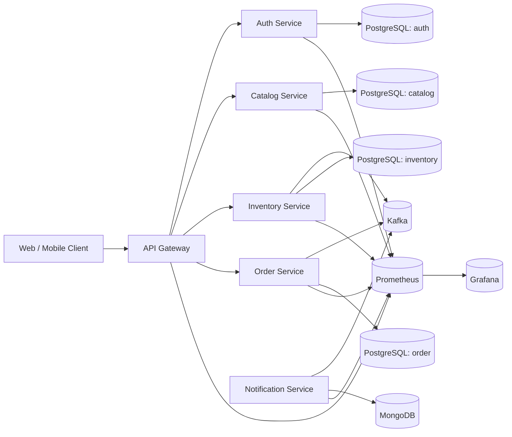
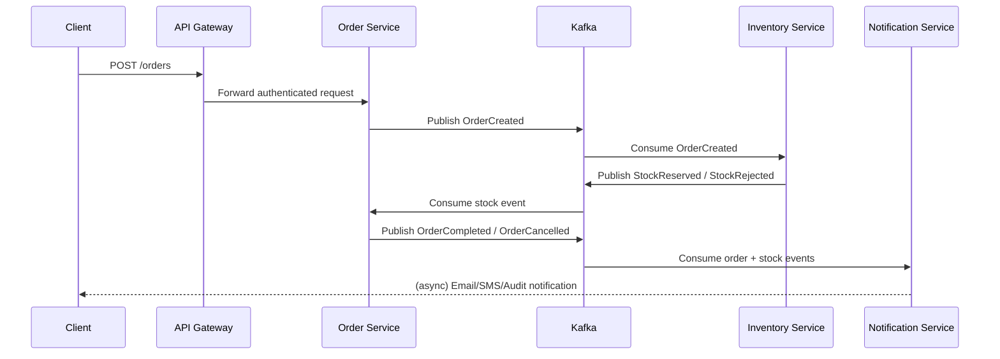

# Architecture Diagrams

## System Context

```mermaid
flowchart LR
    Client[Web / Mobile Client] --> Gateway[API Gateway]
    Gateway --> Auth[Auth Service]
    Gateway --> Catalog[Catalog Service]
    Gateway --> Inventory[Inventory Service]
    Gateway --> Order[Order Service]

    Order --> Kafka[(Kafka)]
    Inventory --> Kafka
    Notification[Notification Service] --> Kafka

    Auth --> AuthDB[(PostgreSQL: auth)]
    Catalog --> CatalogDB[(PostgreSQL: catalog)]
    Inventory --> InventoryDB[(PostgreSQL: inventory)]
    Order --> OrderDB[(PostgreSQL: order)]
    Notification --> Mongo[(MongoDB)]

    Prometheus[(Prometheus)] --> Grafana[(Grafana)]
    Gateway --> Prometheus
    Auth --> Prometheus
    Catalog --> Prometheus
    Inventory --> Prometheus
    Order --> Prometheus
    Notification --> Prometheus
```

## Order Lifecycle (Event-Driven)

```mermaid
sequenceDiagram
    participant C as Client
    participant G as API Gateway
    participant O as Order Service
    participant K as Kafka
    participant I as Inventory Service
    participant N as Notification Service

    C->>G: POST /orders
    G->>O: Forward authenticated request
    O->>K: Publish OrderCreated
    K->>I: Consume OrderCreated
    I->>K: Publish StockReserved / StockRejected
    K->>O: Consume stock event
    O->>K: Publish OrderCompleted / OrderCancelled
    K->>N: Consume order + stock events
    N-->>C: (async) Email/SMS/Audit notification
```
